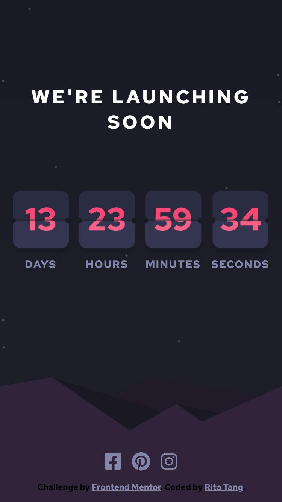
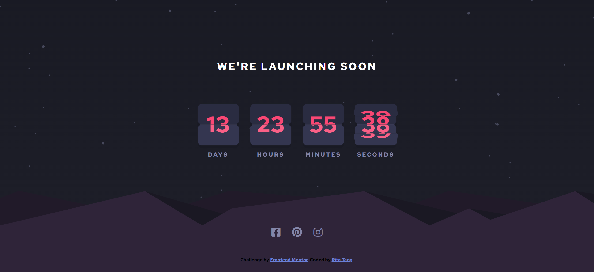

# Frontend Mentor - Launch countdown timer solution

This is a solution to the [Launch countdown timer challenge on Frontend Mentor](https://www.frontendmentor.io/challenges/launch-countdown-timer-N0XkGfyz-).

## Table of contents

- [Overview](#overview)
  - [The challenge](#the-challenge)
  - [Screenshot](#screenshot)
  - [Links](#links)
- [My process](#my-process)
  - [Built with](#built-with)
  - [What I learned](#what-i-learned)
  - [Continued development](#continued-development)
  - [Author](#author)

<hr>

## Overview

### The challenge

The challenge is to build out the project and get it looking as close to the designs inside the `/design` folder as possible. Users should be able to:

- See hover states for all interactive elements on the page
- See a live countdown timer that ticks down every second (start the count at 14 days)
- **Bonus**: When a number changes, make the card flip from the middle

<br>

### Screenshot

<u>Mobile Design</u> <br>


<u>Desktop Design</u> <br>


### Links

- Solution URL: [Here](https://github.com/ritatanght/launch-countdown-timer/)
- Live Site URL: [Here](https://ritatanght.github.io/launch-countdown-timer/)
<hr>

## My process

### Built with

- Semantic HTML5 markup
- CSS custom properties
- Sass
- Flexbox
- CSS Grid

### What I learned

Adding the `perspective` property to the parent element gives a 3D-positioned element some perspective. It defines how far the object is away from the user, hence a lower value will result in a more intensive 3D effect.

```css
/* For Example */
#parent{
  perspective: 500px;
}
#child{
  transform: rotateX(0.5turn);
}
```


### Continued development

Even though I already learned Sass several months back, this is officially the first project that I completed using Sass. It really has its beauty in reducing repetition and making the code more manageable, which I didn't see back when I was unfamiliar with CSS. Since I was thinking of learning Tailwind CSS recently, and I read an article saying that it is recommended to learn Sass first before Tailwind. As a result, I decided to use Sass for this challenge, which is said to contain lots of small CSS tests in the design.


## Author

- Frontend Mentor - [@ritatanght](https://www.frontendmentor.io/profile/ritatanght)

